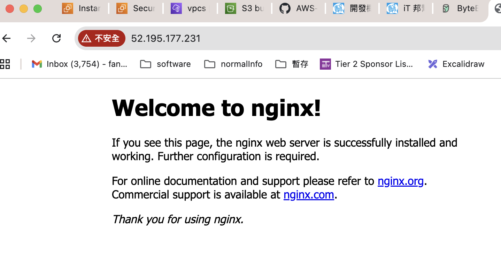
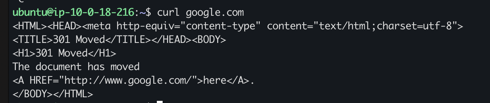

# Tokyo VPC / Subnet / Route Table / EC2 / Nginx / NAT Lab（含 CIDR 計算 + 完整實作步驟）

> Region：**Tokyo `ap-northeast-1`**\
> OS：**Ubuntu EC2**\
> 目標：完成題目 1\~5，並把過程中你遇到的「不清楚點」一次講透。

------------------------------------------------------------------------

## 0. 你要先知道的核心觀念（超重要）

-   **Route Table = 路徑**（封包要走哪裡）\
-   **Security Group = 防火牆**（你准不准它走）\
-   **Public Subnet** 的本質：該 Subnet 綁定的 Route Table 有
    `0.0.0.0/0 → IGW`\
-   **Private Subnet** 的本質：Route Table **沒有**指向
    IGW；若要對外，改指向 **NAT**\
-   **Private EC2 沒有 Public IP** ⇒ **Laptop 無法直接 SSH** ⇒ 只能
    **Laptop → Public EC2（Bastion）→ Private EC2**（除非你另外做 VPN）

------------------------------------------------------------------------

## 1) 建立 VPC：CIDR `10.0.0.0/18`（含計算）

### 1.1 CIDR 代表什麼？怎麼算範圍？

`10.0.0.0/18` 意思是：

-   IPv4 共 32 bits
-   `/18` 表示 **前 18 bits 固定**（network），後 `32-18=14` bits 為
    host
-   總位址數：`2^(14) = 16384`

#### 為什麼是 `10.0.0.0 ~ 10.0.63.255`？

把 `16384` 換成第三個 octet（X）的跳距：

-   每個第三段（X）代表 `256` 個 IP（因為第四段 0\~255）
-   `16384 / 256 = 64`\
-   所以第三段 X 的範圍是 `0 ~ 63`

因此：

``` text
10.0.0.0/18 = 10.0.0.0 ~ 10.0.63.255
```

### 1.2 Console 建立 VPC 步驟

1.  AWS Console 右上角 Region 選 **Tokyo (`ap-northeast-1`)**
2.  進入 **VPC Console → Your VPCs → Create VPC**
3.  設定：
    -   Name: `test-vpc-1`（或你自己的名字）
    -   IPv4 CIDR: `10.0.0.0/18`
4.  Create

------------------------------------------------------------------------

## 2) 建兩個 /20 Subnet（不同 AZ）＋提供 CIDR（含計算）

### 2.1 `/20` 大小怎麼算？

`/20` ⇒ host bits = `32-20=12`\
每段大小 = `2^12 = 4096 IP`

把 `4096` 換算成第三段跳距：

-   `4096 / 256 = 16`
-   所以每個 `/20` 第三段會以 `+16` 遞增

### 2.2 `10.0.0.0/18` 切成 `/20` 的結果

`/18 → /20` 差 2 bits ⇒ 子網數量 `2^(20-18)=4` 段：

``` text
10.0.0.0/20    → 10.0.0.0   ~ 10.0.15.255
10.0.16.0/20   → 10.0.16.0  ~ 10.0.31.255
10.0.32.0/20   → 10.0.32.0  ~ 10.0.47.255
10.0.48.0/20   → 10.0.48.0  ~ 10.0.63.255
```

> 題目只要求「建立兩個
> Subnet」：你只需要從這四塊裡挑兩塊建立即可（其餘保留未來擴充）。

### 2.3 你本次 Lab 建立兩個 Subnet（不同 AZ）

建議用：

  用途             AZ                  CIDR
  ---------------- ------------------- ----------------
  Public Subnet    `ap-northeast-1a`   `10.0.0.0/20`
  Private Subnet   `ap-northeast-1c`   `10.0.16.0/20`

### 2.4 Console 建 Subnet 步驟

1.  VPC Console → **Subnets → Create subnet**
2.  VPC 選 `test-vpc-1`
3.  建立 `public-subnet-a`：
    -   AZ：`ap-northeast-1a`
    -   CIDR：`10.0.0.0/20`
4.  點 **Add new subnet** 再建立 `private-subnet-c`：
    -   AZ：`ap-northeast-1c`
    -   CIDR：`10.0.16.0/20`
5.  Create

------------------------------------------------------------------------

## 3) 建 Route Table 讓兩個 Subnet 變 Public / Private（含 IGW 建立）

### 3.1 先建立並 Attach IGW（你之前卡的點）

1.  VPC Console → **Internet Gateways → Create internet gateway**
    -   Name：`test-igw`
2.  Create 後 → **Actions → Attach to VPC**
    -   選 `test-vpc-1`
3.  Attach

✅ IGW Details 應顯示：State = **Attached**

### 3.2 建立 `public-rt`（給 Public Subnet）

1.  VPC Console → **Route Tables → Create route table**
    -   Name：`public-rt`
    -   VPC：`test-vpc-1`
2.  進入 `public-rt` → **Routes → Edit routes → Add route**
    -   Destination：`0.0.0.0/0`
    -   Target：**Internet Gateway** → 選 `test-igw`
3.  **Subnet associations → Edit subnet associations**
    -   勾選 `public-subnet-a`
    -   Save

`public-rt` 最終應是：

``` text
10.0.0.0/18 → local
0.0.0.0/0   → igw-xxxx
```

### 3.3 建立 `private-rt`（給 Private Subnet）

1.  Route Tables → **Create route table**
    -   Name：`private-rt`
    -   VPC：`test-vpc-1`
2.  不要加 `0.0.0.0/0 → IGW`
3.  **Subnet associations → Edit subnet associations**
    -   勾選 `private-subnet-c`
    -   Save

`private-rt` 先保持：

``` text
10.0.0.0/18 → local
```

> 你之前遇到「不能新增 `0.0.0.0/0 → NAT`」：原因是你在 **public-rt**
> 裡試圖新增第二條 `0.0.0.0/0`（Destination 重複不允許）。\
> NAT 的 `0.0.0.0/0 → nat-xxxx` 必須加在 **private-rt**。

------------------------------------------------------------------------

## 4) 建兩台 EC2（Public / Private）＋從 Laptop SSH 連上兩台（含你遇到的坑）

### 4.1 先建立 Key Pair

EC2 Console → **Key pairs → Create key pair** - Name：`test-ec2` - 下載
`test-ec2.pem` 到你的 Laptop

Laptop 上先做：

``` bash
chmod 400 test-ec2.pem
```

### 4.2 建 `sg-public-ec2`（給 Public EC2）

EC2 Console → Security Groups → Create security group

-   Name：`sg-public-ec2`
-   VPC：**一定要選 `test-vpc-1`**（你之前 SG 不出現就是 VPC 不同）

Inbound rules： - SSH 22 from **My IP**（會變成 `x.x.x.x/32`） - HTTP 80
from `0.0.0.0/0`

Outbound：保持預設（All traffic → 0.0.0.0/0）

### 4.3 建 `sg-private-ec2`（給 Private EC2）

-   Name：`sg-private-ec2`
-   VPC：`test-vpc-1`（必須同 VPC）

Inbound rules： - SSH 22 from **Security group**：選 `sg-public-ec2`

> 這條規則代表：只有掛著 `sg-public-ec2` 的機器（Public EC2）能 SSH
> 進來。

### 4.4 Launch Public EC2（Ubuntu）

EC2 Console → Instances → Launch instances：

-   AMI：Ubuntu
-   Network：
    -   VPC：`test-vpc-1`
    -   Subnet：`public-subnet-a`
    -   Auto-assign public IP：**Enable**
-   Security group：`sg-public-ec2`
-   Key pair：`test-ec2`

建立完成後，記下： - Public IPv4：`<public-ip>` - Private
IP：`<public-private-ip>`

從 Laptop 連線：

``` bash
ssh -i test-ec2.pem ubuntu@<public-ip>
```

> 你之前出現 `Permission denied (publickey)`：Ubuntu 的 username 是
> `ubuntu`，不是 `ec2-user`。

### 4.5 Launch Private EC2（Ubuntu）

-   VPC：`test-vpc-1`
-   Subnet：`private-subnet-c`
-   Auto-assign public IP：**Disable**
-   Security group：`sg-private-ec2`
-   Key pair：`test-ec2`

建立完成後，記下： - Private IP：例如 `10.0.16.23`（**沒有 Public IP**）

### 4.6 從 Laptop SSH 連 Private EC2（Bastion / Jump Host）

> 題目說「從 laptop 連兩台」，在沒有 VPN 的前提下，Private EC2 沒 Public
> IP 只能用跳板：\
> **Laptop → Public EC2 → Private EC2**

**步驟：**

1)  Laptop → Public：

``` bash
ssh -i test-ec2.pem ubuntu@<public-ip>
```

2)  把 key 放到 Public（你剛剛問的那行）：

``` bash
# 在 Laptop 執行
scp -i test-ec2.pem test-ec2.pem ubuntu@<public-ip>:/home/ubuntu/
```

3)  Public → Private（在 Public EC2 上執行）：

``` bash
chmod 400 /home/ubuntu/test-ec2.pem
ssh -i /home/ubuntu/test-ec2.pem ubuntu@<private-ip>
```

✅ 成功後你會進到 Private EC2 的 shell。

------------------------------------------------------------------------

## 5) Public EC2 安裝 nginx + 瀏覽器驗證（截圖）

在 **Public EC2（Ubuntu）**：

``` bash
sudo apt update
sudo apt install -y nginx
sudo systemctl enable nginx
sudo systemctl start nginx
sudo systemctl status nginx --no-pager
```

看到 `active (running)` 後，從 Laptop 的瀏覽器打：

``` text
http://<public-ip>
```

看到 Welcome to nginx 頁面 → 截圖（含網址列 Public IP）。



> 若看不到：通常是 SG 沒開 HTTP 80、或你打成 https。

------------------------------------------------------------------------

## 6) Private EC2 `curl google.com`（用 NAT Gateway）

### 6.1 先在 Private EC2 測試（會卡住/沒反應）

在 Private EC2：

``` bash
curl https://www.google.com
```

沒反應/timeout 是正常的：因為 Private Subnet 沒有對外路由。

### 6.2 建 NAT Gateway（一定在 Public Subnet）

> NAT Gateway 的工作：讓 Private Subnet
> 裡的機器「可以主動連外」，但「外界不能主動連入」。

1)  VPC Console → **Elastic IPs → Allocate Elastic IP**
2)  VPC Console → **NAT Gateways → Create NAT gateway**
    -   Subnet：選 **public-subnet-a**
    -   Connectivity type：Public
    -   EIP allocation：選剛剛的 EIP（或 Automatic 也可）
3)  建立後等待 State 變成 **Available**
4)  記下 NAT ID：例如 `nat-17a151327f0b6ae17`

### 6.3 在 `private-rt` 加上 `0.0.0.0/0 → NAT`

到 VPC Console → Route Tables → `private-rt` → Routes → Edit routes →
Add route：

-   Destination：`0.0.0.0/0`
-   Target：NAT Gateway → 選 `nat-xxxx`

這行的意思：

-   `0.0.0.0/0` = 全部外網目的地
-   指向 `nat-xxxx` = 所有外網流量都先交給 NAT 轉送

> 你之前遇到「不能新增」：是因為你在 **public-rt** 裡已經有
> `0.0.0.0/0 → IGW`，同一張表不能有兩條 `0.0.0.0/0`。\
> NAT 只能放在 **private-rt**。

另外確認：`private-rt` 的 **Subnet associations** 真的綁到
`private-subnet-c`。

### 6.4 再回 Private EC2 測試（成功回 HTML）

在 Private EC2：

``` bash
curl https://www.google.com
```


你應該看到 HTML（成功）。

流量路徑：

``` text
Private EC2
  → private-rt (0.0.0.0/0 → NAT)
  → NAT Gateway（在 Public Subnet）
  → public-rt (0.0.0.0/0 → IGW)
  → Internet
```

------------------------------------------------------------------------

## 7) 常見錯誤速查（你這次真的踩過的）

### 7.1 SG 沒出現在選單

-   原因：SG 跟 EC2 選的 VPC 不同（SG 是 VPC scoped）
-   解法：建立 SG 時 **VPC 選 `test-vpc-1`**

### 7.2 SSH `Permission denied (publickey)`

-   原因：Ubuntu username 用錯（要 `ubuntu`）或 key 不匹配
-   解法：EC2 Connect 頁面看 AWS 建議指令

### 7.3 NAT 建好了但 `curl` 仍卡

-   你常漏掉其中一個：
    -   `private-rt` 沒加 `0.0.0.0/0 → NAT`
    -   Private Subnet 沒綁 `private-rt`
    -   NAT 不在 Public Subnet
    -   public-rt 沒有 `0.0.0.0/0 → IGW`（NAT 自己出不去）

### 7.4 為什麼不能在同一張 Route Table 同時放 IGW 與 NAT？

-   因為目的地 `0.0.0.0/0` 不能重複
-   Public Subnet 的 `0.0.0.0/0` 就是 IGW
-   Private Subnet 的 `0.0.0.0/0` 就是 NAT

------------------------------------------------------------------------

## 8) 你完成的成果（對應題目）

1.  ✅ VPC `10.0.0.0/18` + 兩個 `/20` Subnet（不同 AZ）
2.  ✅ Public/Private Route Table（public→IGW, private→local/後續→NAT）
3.  ✅ Public/Private EC2 建立；Laptop 透過 Bastion SSH 兩台
4.  ✅ Public EC2 安裝 nginx；瀏覽器用 Public IP 看到頁面並截圖
5.  ✅ Private EC2 透過 NAT 成功 `curl google.com` 回 HTML

------------------------------------------------------------------------

### 附錄：CIDR 快速公式（面試/筆記用）

-   網段大小（IP 數）：`2^(32 - prefix)`\
-   子網數量：`2^(newPrefix - oldPrefix)`\
-   `/18 → /20`：`2^(20-18)=4` 段\
-   `/20` 每段 4096 IP；換成第三段跳距：`4096/256=16`（所以
    0、16、32、48）
