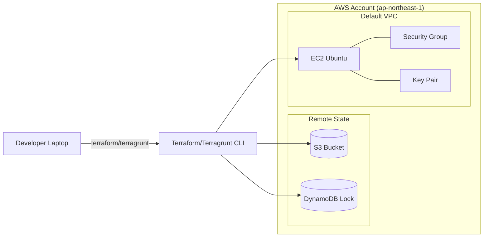

# Lab 3 - Terraform + Terragrunt EC2

本 Lab 示範：
- Terraform module + multi-env
- S3 remote backend + DynamoDB lock
- Terragrunt 集中管理 provider/backend

## Architecture


## Structure
```
lab/task3/
  bootstrap/
  terraform-live/
    modules/ec2/
    envs/dev/
  terragrunt-live/
    modules/ec2/
    live/
  keys/
  diagrams/
```

## Prerequisites
- Terraform >= 1.6
- AWS CLI + 有權限的 profile
- (可選) Terragrunt

## Bootstrap (Remote Backend)
1) 填入 bucket 名稱
- 檔案：`bootstrap/variables.tf`
- 執行時傳入 `tfstate_bucket_name`

2) 指令
```bash
cd bootstrap
AWS_PROFILE=<profile> terraform init
AWS_PROFILE=<profile> terraform plan -var="tfstate_bucket_name=tfstate-<account-id>-apne1"
AWS_PROFILE=<profile> terraform apply -var="tfstate_bucket_name=tfstate-<account-id>-apne1"
```

## Terraform Live (dev)
1) 先補齊變數
- `terraform-live/envs/dev/terraform.tfvars`
  - `allowed_ssh_cidr = "<YOUR_PUBLIC_IP>/32"`
  - `public_key_path  = "<PUBLIC_KEY_PATH>"`
  - `tags.Owner = "<YOUR_NAME>"`

2) backend 設定
- `terraform-live/envs/dev/backend.tf`
  - `bucket = "tfstate-<account-id>-apne1"`

3) 指令
```bash
cd ../terraform-live/envs/dev
AWS_PROFILE=<profile> terraform init
AWS_PROFILE=<profile> terraform plan
AWS_PROFILE=<profile> terraform apply
AWS_PROFILE=<profile> terraform output
```

## Terragrunt (dev)
1) 先補齊 inputs
- `terragrunt-live/live/dev/ap-northeast-1/ec2/terragrunt.hcl`
  - `allowed_ssh_cidr = "<YOUR_PUBLIC_IP>/32"`
  - `public_key_path  = "<PUBLIC_KEY_PATH>"`
  - `bucket = "tfstate-<account-id>-apne1"`

2) 指令
```bash
cd ../../terragrunt-live/live/dev/ap-northeast-1/ec2
AWS_PROFILE=<profile> terragrunt init
AWS_PROFILE=<profile> terragrunt plan
AWS_PROFILE=<profile> terragrunt apply
```

## Outputs
- `ec2_public_ip`
- `ec2_public_dns`
- `ec2_ssh_command`

## Destroy
```bash
cd terraform-live/envs/dev
AWS_PROFILE=<profile> terraform destroy
```

若要移除 backend：
```bash
cd ../../bootstrap
AWS_PROFILE=<profile> terraform destroy -var="tfstate_bucket_name=tfstate-<account-id>-apne1"
```

## Notes / Pitfalls
- `allowed_ssh_cidr` 請填公網 IPv4，不是 192.168.x.x。
- Terragrunt 會用 `.terragrunt-cache`，相對路徑可能失效，建議用絕對路徑。
- S3 bucket 有版本控管時，刪除前需先清空版本。

## Note
- 本 Lab 未建立自訂網路資源（VPC/Subnet/NAT/IGW），目前使用預設 VPC；後續可補。
- 目前僅示範建立 EC2 與其必要周邊資源（SG/Key Pair）。
